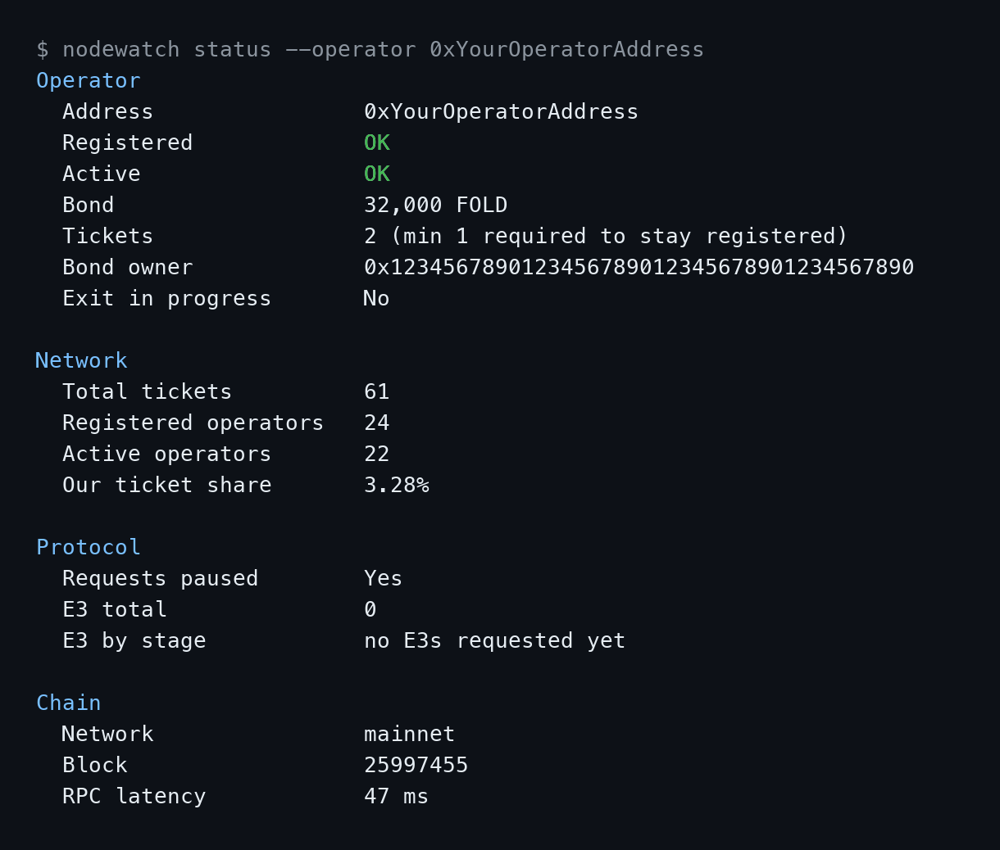

# interfold-nodewatch

A small TypeScript CLI for operators of [Interfold](https://docs.theinterfold.com) ciphernode nodes on Ethereum mainnet. It answers the questions a node operator actually checks day to day: *am I still registered and active, is my bond and ticket balance where I left it, did anything get slashed, is the protocol paused, and how many E3 (Encrypted Execution Environment) requests has it processed* — from the chain directly, with no private key and no write access needed.

- `nodewatch status` — one-shot table or JSON snapshot
- `nodewatch watch` — polls the chain and alerts on stdout / Telegram when something changes
- `nodewatch exporter` — Prometheus `/metrics` + Grafana dashboard
- `nodewatch e3 <id>` — inspect a single E3 request's lifecycle
- `nodewatch version` — compare the latest interfold release against your local `interfold` binary



## Why

Ciphernode operators post a FOLD bond and hold tFOLD tickets to participate in Interfold's threshold FHE committees. If your operator silently deregisters, your bond gets partially slashed, or `requestsPaused` flips, you want to know from a cron job or a dashboard — not by noticing your rewards stopped. This tool is read-only and safe to run next to your actual ciphernode.

## Install

```bash
git clone https://github.com/Zol55/interfold-nodewatch.git
cd interfold-nodewatch
npm install
npm run build
cp .env.example .env   # fill in OPERATOR_ADDRESS at least
node dist/cli.js status
```

Optionally link it as a global command: `npm link` (then `nodewatch status ...` works from anywhere). Publishing to npm is on the roadmap.

Node.js >= 20 is required. No pnpm/yarn assumptions -- npm only.

## Configuration

All commands read from `.env` (or the real environment) and every value can be overridden per command with a flag:

| Env var | Flag | Default | Used by |
|---|---|---|---|
| `RPC_URL` | `--rpc-url` | `https://ethereum-rpc.publicnode.com` | all |
| `CHAIN` | `--chain` | `mainnet` | all |
| `OPERATOR_ADDRESS` | `--operator` | - | `status`, `watch`, `exporter` |
| `TELEGRAM_BOT_TOKEN` | - | - | `watch` |
| `TELEGRAM_CHAT_ID` | - | - | `watch` |
| `POLL_INTERVAL` | `--interval` | `60` (seconds) | `watch` |
| `EXPORTER_PORT` | `--port` | `9464` | `exporter` |
| `RELEASE_CHECK_MINUTES` | `--release-check-interval` | `60` (minutes) | `watch`, `exporter` |

See [`.env.example`](.env.example).

## Commands

### `nodewatch status`

```
$ nodewatch status --operator 0xYourOperatorAddress
Operator
  Address                0xYourOperatorAddress
  Registered             OK
  Active                 OK
  Bond                   32,000 FOLD
  Tickets                2 (min 1 required to stay registered)
  Bond owner             0x1234567890123456789012345678901234567890
  Exit in progress       No

Network
  Total tickets          61
  Registered operators   24
  Active operators       22
  Our ticket share       3.28%

Protocol
  Requests paused        Yes
  E3 total               0
  E3 by stage            no E3s requested yet

Chain
  Network                mainnet
  Block                  25997455
  RPC latency            47 ms
```

Add `--json` for a machine-readable version (bigints are serialized as decimal strings) -- handy for feeding into another script or a status page.

### `nodewatch watch`

```
$ nodewatch watch --interval 60
[watch] polling every 60s for 0xYourOperatorAddress on mainnet (release checks every 60min). Ctrl+C to stop.
[WARNING] Ticket balance changed: 2 -> 1 tickets
[CRITICAL] SLASHED: 500 tFOLD, 0 FOLD bond (tx 0x...)
```

Polls over plain HTTP JSON-RPC (no websocket needed), keeps a small `state.json` between ticks, and prints one line per change plus a Telegram message if `TELEGRAM_BOT_TOKEN`/`TELEGRAM_CHAT_ID` are set. The first tick after starting (or after deleting `state.json`) never alerts -- there's nothing to compare against yet.

It alerts on:

- Registered / Active flipping
- Bond or ticket balance changing (decreases are flagged more severely than increases)
- `PendingAssetsSlashed`, `AssetsQueuedForExit`, `CiphernodeDeregistrationRequested` for your operator
- Your operator joining/leaving an E3 committee (`CommitteeObligationUpdated`)
- The protocol's `requestsPaused` flipping
- New E3 requests landing on-chain
- The RPC endpoint failing 3 polls in a row (and recovering)
- A new interfold release appearing on GitHub, and your local `interfold` binary falling behind it (checked every `--release-check-interval` minutes, default 60 -- see [Release tracking](#release-tracking))

Add `--local` to also run `interfold ciphernode status` on the same machine and alert if that command fails, or if its reported Registered/Active disagrees with the chain -- useful as a sanity check that your local ciphernode process and its on-chain state agree. This is best-effort: the exact output format of that command isn't publicly documented, so nodewatch looks for `Registered`/`Active` followed by a boolean-ish token and otherwise stays quiet about it. The status command makes several RPC calls through your node's own `rpc_url`, so it runs only every `--local-check-interval` minutes (default 10), and a problem is reported once when it appears and once when it clears -- not every tick. A typical thing it catches: the node's RPC provider rate-limiting (`HTTP error 429 ... rate limit exceeded`) while the on-chain state is still fine.

### `nodewatch exporter`

```
$ nodewatch exporter --port 9464
[exporter] listening on :9464 (/metrics, /healthz), polling every 60s
```

```
$ curl localhost:9464/metrics
interfold_operator_registered 1
interfold_operator_active 1
interfold_operator_bond_fold 32000
interfold_operator_tickets 2
interfold_network_tickets 61
interfold_ticket_share 3.28
interfold_requests_paused 1
interfold_e3_total 0
interfold_e3_by_stage{stage="Requested"} 0
interfold_e3_by_stage{stage="CommitteeFinalized"} 0
interfold_e3_by_stage{stage="KeyPublished"} 0
interfold_e3_by_stage{stage="CiphertextReady"} 0
interfold_e3_by_stage{stage="Complete"} 0
interfold_e3_by_stage{stage="Failed"} 0
interfold_rpc_up 1
interfold_last_block 25997456
interfold_release_latest_info{tag="v0.15.0"} 1
interfold_update_available 0
```

(`interfold_local_version_info{tag="..."}` only appears if the `interfold` binary is found on `PATH`; see [Release tracking](#release-tracking).)

`/healthz` returns `200 ok` as long as the HTTP server is up (independent of whether the last chain refresh succeeded -- check `interfold_rpc_up` for that).

#### Grafana in three commands

```bash
cp .env.example .env        # set OPERATOR_ADDRESS
docker compose up -d --build
open http://localhost:3000  # Grafana, anonymous viewer access enabled; the
                             # "Interfold Nodewatch" dashboard is pre-provisioned
```

This starts the exporter, Prometheus (scraping it every 30s), and Grafana (provisioned with a Prometheus datasource and the dashboard in [`grafana/dashboard.json`](grafana/dashboard.json)).

The dashboard has panels for registration/active state, bond, tickets and network share, requestsPaused, E3 counts by stage, RPC health and the release/update gauges (see [`grafana/dashboard.json`](grafana/dashboard.json)).

### `nodewatch e3 <id>`

```
$ nodewatch e3 0
E3 #0 does not exist yet (no E3s have been requested with this id).
Tip: run `nodewatch status` to see the total E3 count and try a lower id.
```

```
$ nodewatch e3 3
E3 #3
  Stage:              CiphertextReady
  Requester:           0x1234567890123456789012345678901234567890
  Committee size:      3
  Request block:       25801234
  E3 program:          0x4976e5e47852efce6851d35b95a1a2e19456f3d7
  Committee key set:   true
  Ciphertext ready:    true
  Plaintext ready:     false
```

If the E3 failed, a `Failure reason:` line is added (one of the reasons from `@interfold/sdk`'s `FailureReason` enum: `CommitteeFormationTimeout`, `DKGTimeout`, `ComputeProviderFailed`, etc).

## Release tracking

```
$ nodewatch version
Latest interfold release: v0.15.0
  Published: 2026-09-17T01:49:12Z
  URL:       https://github.com/theinterfold/interfold/releases/tag/v0.15.0

Local interfold version: 0.13.0

Update available: local v0.13.0 -> latest v0.15.0
```

`nodewatch version` compares the latest published [interfold release](https://github.com/theinterfold/interfold/releases) against the `interfold` binary on this machine (`interfold --version`), if any. If no local binary is found it says so and just prints the latest release info.

It deliberately does not use GitHub's `GET /repos/{repo}/releases/latest` endpoint: for this repo, that endpoint currently returns an older tag (`v0.13.0`) than the actual highest release (`v0.15.0`) -- GitHub picks "latest" by publish order among releases, and this repo has published a few out of strict semver order. Instead nodewatch fetches the recent releases list, drops drafts/prereleases, and picks the highest **semver** tag (falling back to the plain tags list if the repo ever has zero releases). See [`src/core/release.ts`](src/core/release.ts).

`watch` and `exporter` run the same check on a separate timer (`--release-check-interval` / `RELEASE_CHECK_MINUTES`, default 60 minutes -- independent of the chain poll interval, since GitHub's anonymous API rate limit is much tighter than any sane chain-polling interval):

- `watch` alerts once when a new release tag appears (comparing against the previous check's tag, stored in `state.json`), and once when the local binary is found to be behind the latest release -- then stays quiet about that same release until either it's caught up, or an even newer release appears.
- `exporter` exposes `interfold_release_latest_info{tag="v0.15.0"} 1` (an "info" gauge: value is always 1, the tag lives in the label), `interfold_local_version_info{tag="0.13.0"} 1` (absent if no local binary), and `interfold_update_available` (0 or 1).

## About `@interfold/sdk`

This project deliberately does **not** depend on [`@interfold/sdk`](https://www.npmjs.com/package/@interfold/sdk). The SDK is the "correct" way to talk to Interfold for anything involving FHE (encrypting inputs, generating proofs, requesting E3s), but for a read-only status tool it pulls in a lot that isn't needed:

- `@aztec/bb.js` (Barretenberg, a WASM proving backend) and `@noir-lang/noir_js` -- multi-megabyte FHE/proving toolchain
- a `git+ssh://git@github.com/...` transitive dependency (`era-contracts`), which fails to install in most CI runners and sandboxes that don't have an SSH key provisioned for GitHub
- ~580 transitive packages and a 2+ minute install, versus a handful for this tool's actual dependencies (`viem`, `commander`, `prom-client`)

So `nodewatch e3` and the E3 counts in `status`/`exporter` read the coordinator contract directly via `viem` with a minimal hand-written ABI (verified live against mainnet, see [`src/chain/abi/coordinator.ts`](src/chain/abi/coordinator.ts)), and the `E3Stage`/`FailureReason` enums are copied 1:1 from the SDK's type definitions so the two stay compatible. If you already have `@interfold/sdk` installed for other tooling, swapping the `e3` command over to `InterfoldSDK.getE3()`/`getE3Stage()`/`getFailureReason()` is a small change (the SDK's `ContractClient` exposes the same three calls this tool makes by hand).

One caveat found during development: the coordinator's `nexte3Id()` getter did not decode to a plausible counter value when called live (see the comment in `coordinator.ts`) -- `status`/`exporter`/`e3` instead find the E3 total by walking `getE3Stage(0), getE3Stage(1), ...` until the first unrequested id, which is cheap while the protocol has few E3 requests.

## Contracts (mainnet)

| Contract | Address |
|---|---|
| Interfold (coordinator) | `0x28cF63B459e6218C69EA97ea7D90541cf648c715` |
| BondingRegistry (proxy) | `0x0ec90465095C21830BEcED07e032809A2Bd2915F` |
| FOLD | `0xe172e9b6cfbeeb5593bdce3f077356fdb33af904` |
| tFOLD (ticket token) | `0xc0b5b49a3949ec4b520ef21bacfe16e3695f3b5d` |
| sUSDS (tFOLD underlying) | `0xa3931d71877c0e7a3148cb7eb4463524fec27fbd` |

Sepolia addresses (from [`packages/interfold-contracts/deployed_contracts.json`](https://github.com/theinterfold/interfold/blob/main/packages/interfold-contracts/deployed_contracts.json) in the Interfold monorepo, not independently re-verified live) are in [`src/chain/addresses.ts`](src/chain/addresses.ts). Override any of them with `--chain sepolia` plus your own RPC, or by editing that file for a fork/local deployment.

## Security

- **No private key, ever.** Every call this tool makes is a read (`eth_call`/`eth_getLogs`/`eth_blockNumber`). There is nowhere in the codebase that accepts, stores, or asks for a private key.
- Your operator address is a public on-chain fact; passing it as a flag or env var carries no more risk than looking it up on Etherscan.
- `watch`'s Telegram integration only ever sends outbound `sendMessage` calls with your bot token -- it never reads updates, so it can't receive or act on commands sent to the bot.
- `--local` shells out to `interfold ciphernode status` via `child_process.exec` with a fixed, non-interpolated command string -- no user input reaches the shell. Release tracking does the same for `interfold --version`.
- Release tracking makes unauthenticated read-only requests to `api.github.com` (public releases/tags of the `theinterfold/interfold` repo). No token is sent or required.

## Development

```bash
npm install
npm run lint
npm run typecheck
npm test
npm run build
```

`npm run dev -- status --operator 0x...` runs the CLI from source via `tsx`, no build step needed.

## Roadmap

- Publish to npm (`npx interfold-nodewatch`)
- WebSocket subscriptions for `watch` as an opt-in alternative to polling
- `nodewatch e3 --watch <id>` to follow one E3's lifecycle live
- Multi-operator support (`--operator` accepting a comma-separated list) for operators running several nodes
- Optional indexer/subgraph backend for `status`'s E3 history once the protocol has enough volume that the linear `getE3Stage` scan stops being cheap
- Switch the `e3` command over to `@interfold/sdk` once its dependency footprint is lighter (or make it pluggable)

## License

MIT, see [`LICENSE`](LICENSE).
